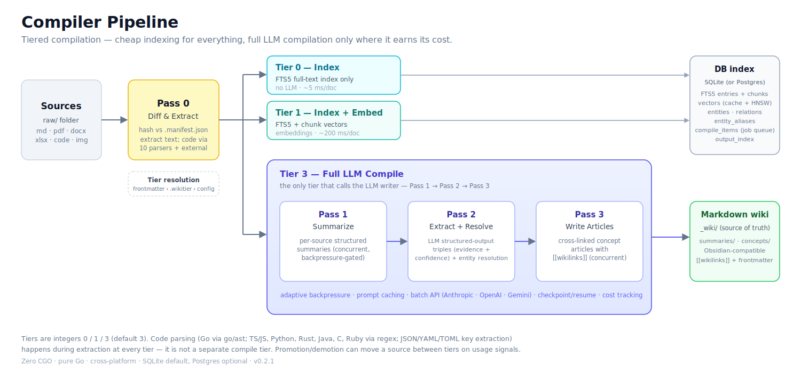
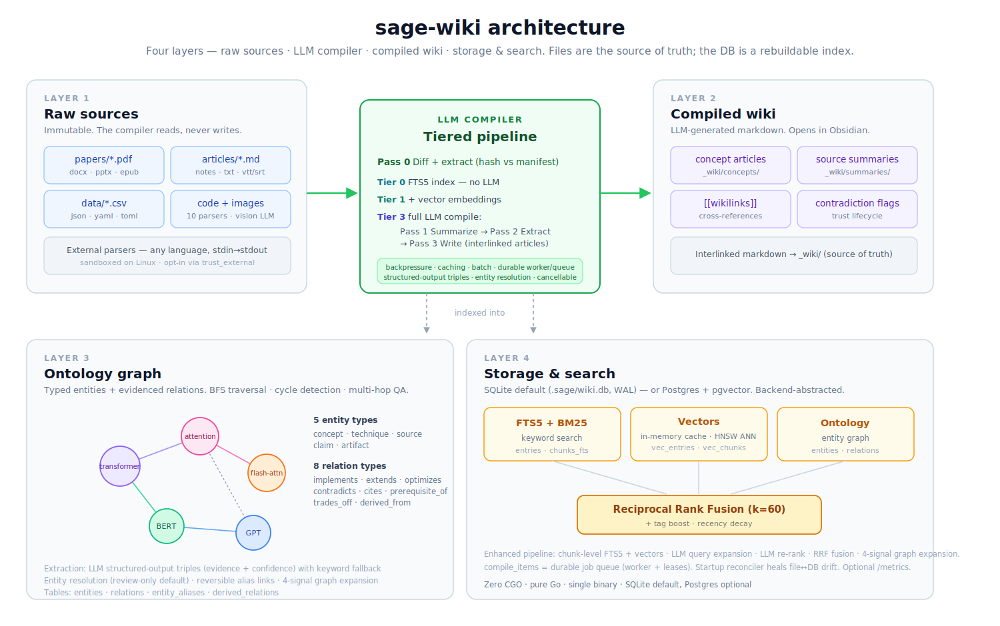

**English** | [中文](README_zh.md) | [日本語](README_ja.md) | [한국어](README_ko.md) | [Tiếng Việt](README_vi.md) | [Français](README_fr.md) | [Русский](README_ru.md)

# sage-wiki

**sage-wiki** is a graph memory and knowledge base that AI agents and humans build and query together. Drop in documents; an LLM compiler turns them into an interlinked wiki with a knowledge graph — agents query it through MCP, humans browse it as plain markdown. Enable the opt-in graph passes and it becomes an *evidenced* graph: typed entities, provenance-bearing relations, resolved aliases, and per-fact citations on answers. One Go binary scales it from a personal vault to a team hub to a company knowledge graph.

**→ Get started: [Install](#install) · [Quickstart](#quickstart)**

Grown from [Andrej Karpathy's idea](https://x.com/karpathy/status/2039805659525644595) of an LLM-compiled personal knowledge base, built with the [Sage Framework](https://github.com/xoai/sage). Some lessons learned along the way [here](https://x.com/xoai/status/2040936964799795503).

- **Graph memory with citations.** Ask relational questions through `wiki_graph_query` — answers are grounded only in serialized graph edges; with the evidenced graph enabled, each citation carries its source document and confidence.
- **Built for agents and humans.** 18 MCP tools plus generated skill files teach agents when to search, capture, and compile; humans get Obsidian-native markdown, a TUI, and a web UI over the same data.
- **Trust and provenance.** Query outputs quarantine until verified; every evidenced relation records which document asserted it.
- **Your sources in, a wiki out.** The compile pipeline reads papers, notes, code, and email; summarizes; extracts concepts; and writes interconnected articles — the ingestion layer for everything above. Every new source enriches existing articles; the wiki compounds as it grows.
- **Ask your wiki questions.** Hybrid chunk-level search with LLM query expansion, re-ranking, and graph-aware context assembly returns cited answers.
- **Scales to 100K+ documents.** Tiered compilation indexes everything fast and spends LLM budget only where it matters.

https://github.com/user-attachments/assets/c35ee202-e9df-4ccd-b520-8f057163ff26

_Dots on the outer boundary represent summaries of all documents in the knowledge base, while dots in the inner circle represent concepts extracted from the knowledge base, with links showing how those concepts connect to one another._

## From personal vault to company knowledge graph

- **Personal** — overlay an existing Obsidian vault (`init --vault`), run on [local models](docs/guides/local-models.md) for zero cost, and opt into the graph passes (`ontology.triples` + `ontology.resolve`) when you want the evidenced graph.
- **Team** — share one wiki via git or a [self-hosted server](docs/guides/self-hosted-server.md), review entity-resolution proposals and [output trust](docs/guides/output-trust.md) together, and federate multiple wikis with the hub. See [Team Setup](docs/guides/team-setup.md).
- **Company** — move storage to [PostgreSQL/pgvector](docs/guides/storage-backends.md), turn on [metrics](docs/guides/metrics.md), front the server with auth, and scale ingestion with [tiered compilation](docs/guides/large-vault-performance.md).

## Knowledge graph & graph memory


Vector search retrieves passages that *look like* the query. A graph also
records **how things relate**, so a question needing two or three hops is
answered by traversal instead of hoping one chunk happens to contain the whole
chain. sage-wiki builds that graph as a compile output — not a second database
you have to keep in sync.

- **Entities and typed relations.** Each compile extracts entities (concepts,
  sources, artifacts) and links them with typed relations. The relation
  vocabulary is yours to define — see
  [configurable relations](docs/guides/configurable-relations.md).
- **Evidenced edges.** A relation can carry `evidence` (the span that supports
  it), `confidence` (0–1), and `source_doc`, so a conclusion traces to the
  sentence that justified the edge rather than to a whole document.
- **Triples.** An optional structured-output pass extracts
  subject → relation → object directly. Opt-in (`ontology.triples`): it adds
  one LLM call per document, and defaults never spend your key without asking.
- **Entity resolution.** "K8s" and "Kubernetes" become one node. Proposals are
  review-gated by default rather than silently merged.

**The graph is a retrieval channel, not a side view.** Every search fuses three
channels — lexical (BM25), vector, and graph proximity: query terms seed
entities, a bounded traversal ranks their neighborhood, and the three fuse at
`search.hybrid_weight_graph`. An empty ontology costs nothing and leaves
results byte-identical, so the graph earns its place incrementally.

Query it directly, or let an agent do it over MCP:

```bash
sage-wiki ontology query --entity kubernetes --depth 3 --direction both
sage-wiki provenance "service mesh"    # which sources produced this concept
```

Edges are bi-temporal: contradicting a fact invalidates the old edge instead
of colliding, default answers are contradiction-free, and `as_of` queries
answer "what did we believe in January?" Ambiguous contradictions still
surface through [output trust](docs/guides/output-trust.md) review. For
corpus-wide questions ("main themes across everything?"), opt-in community
detection (`ontology.communities.enabled`) generates cached community
summaries and answers via `wiki_graph_query` `mode: "global"`. Depth
and mechanics: [graph memory](docs/guides/graph-memory.md).

## Guides

| Guide | Description |
|-------|-------------|
| [Agent Memory Layer](docs/guides/agent-memory-layer.md) | MCP setup, skill files, capture workflows, read-capture-evolve loop |
| [HTTP API](docs/guides/http-api.md) | The /v1 REST surface: auth, error model, idempotency, async jobs |
| [Graph Memory](docs/guides/graph-memory.md) | Evidenced relations, triple extraction, entity resolution, graph QA |
| [Configuration](docs/guides/configuration.md) | The full annotated config.yaml, multi-provider setup, serve worker |
| [Team Setup](docs/guides/team-setup.md) | Git-synced, shared server, and hub federation deployment patterns |
| [Search Quality](docs/guides/search-quality.md) | Chunk indexing, query expansion, re-ranking, graph expansion, ANN |
| [Large Vault Performance](docs/guides/large-vault-performance.md) | Tiered compilation, backpressure, code parsers, 100K+ scaling |
| [Output Trust](docs/guides/output-trust.md) | Grounding verification, consensus, promotion/demotion lifecycle |
| [Subscription Auth](docs/guides/subscription-auth.md) | OAuth login, token import, credential management |
| [Self-Hosted Server](docs/guides/self-hosted-server.md) | Docker Compose, Syncthing, reverse proxy, VPS deployment |
| [Storage Backends](docs/guides/storage-backends.md) | SQLite vs PostgreSQL/pgvector setup, switching, pool sizing |
| [Configurable Relations](docs/guides/configurable-relations.md) | Custom ontology types, multilingual synonyms, type restrictions |
| [Customizing Prompts](docs/guides/customizing-prompts.md) | Prompt scaffolding, per-type overrides, custom frontmatter fields |
| [Local Models](docs/guides/local-models.md) | Ollama setup, GPU/CPU routing, per-pass model config |
| [Metrics](docs/guides/metrics.md) | Log snapshots, /metrics endpoint, cardinality controls |
| [Contribution Packs](CONTRIBUTING.md) | Creating packs, parser authoring, registry submission |

## Install

```bash
# CLI only (no web UI)
go install github.com/xoai/sage-wiki/cmd/sage-wiki@latest

# With web UI (requires Node.js for building frontend assets)
git clone https://github.com/xoai/sage-wiki.git && cd sage-wiki
cd web && npm install && npm run build && cd ..
go build -tags webui -o sage-wiki ./cmd/sage-wiki/
```

## Quickstart



### Greenfield (new project)

```bash
sage-wiki init my-wiki && cd my-wiki
# Add sources to raw/
cp ~/papers/*.pdf raw/
# Edit config.yaml to add api key, and pick LLMs
sage-wiki compile                                  # first compile
sage-wiki search "attention mechanism"             # hybrid search
sage-wiki query "How does flash attention work?"   # cited Q&A
sage-wiki tui                                      # terminal dashboard
sage-wiki serve --ui                               # browser (webui build)
sage-wiki compile --watch                          # watch folder
```

Every `config.yaml` key, annotated line by line: [Configuration](docs/guides/configuration.md).

### Vault Overlay (existing Obsidian vault)

```bash
cd ~/Documents/MyVault
sage-wiki init --vault
# Edit config.yaml to set source/ignore folders, add api key, pick LLMs
sage-wiki compile --watch
```

Prefer containers? Prebuilt multi-arch Docker images and compose files are
covered in the [self-hosted server guide](docs/guides/self-hosted-server.md).

## Supported Source Formats

| Format      | Extensions                              | What gets extracted                                         |
| ----------- | --------------------------------------- | ----------------------------------------------------------- |
| Markdown    | `.md`                                   | Body text with frontmatter parsed separately                |
| PDF         | `.pdf`                                  | Full text via pure-Go extraction                            |
| Word        | `.docx`                                 | Document text from XML                                      |
| Excel       | `.xlsx`                                 | Cell values and sheet data                                  |
| PowerPoint  | `.pptx`                                 | Slide text content                                          |
| CSV         | `.csv`                                  | Headers + rows (up to 1000 rows)                            |
| EPUB        | `.epub`                                 | Chapter text from XHTML                                     |
| Email       | `.eml`                                  | Headers (from/to/subject/date) + body                       |
| Plain text  | `.txt`, `.log`                          | Raw content                                                 |
| Transcripts | `.vtt`, `.srt`                          | Raw content                                                 |
| Images      | `.png`, `.jpg`, `.gif`, `.webp`, `.svg`, `.bmp` | Description via vision LLM (caption, content, visible text) |
| Code        | `.go`, `.py`, `.js`, `.ts`, `.rs`, etc. | Source code                                                 |

Just drop files into your source folder — sage-wiki detects the format automatically. Images require a vision-capable LLM (Gemini, Claude, GPT-4o). Need a format not listed? sage-wiki supports [external parsers](#external-parsers) — scripts in any language reading stdin, writing text to stdout.

## Graph memory

Out of the box the wiki builds a knowledge graph from keyword proximity —
concepts linked where relation keywords co-occur with a `[[wikilink]]` in
the same block. Enable the
**opt-in graph passes** to turn that into an evidenced graph:

- **Triple extraction** (`ontology.triples.enabled`) — one extra LLM call
  per fully-compiled document extracts typed entities and relations, each
  carrying an evidence span, confidence, and source document.
- **Entity resolution** (`ontology.resolve.enabled`) — surface-form
  variants ("NASA" / "National Aeronautics and Space Administration")
  are linked to a canonical entity. High-confidence proposals apply
  automatically (threshold 0.85; set exactly `1.0` for review-only), and
  every link is exactly reversible with `ontology resolve --unlink`.
- **Graph QA** — the `wiki_graph_query` MCP tool answers multi-hop
  relational questions grounded *only* in a bounded, serialized set of
  edges; citations carry `source_doc` and `confidence` when the edge is
  evidenced (keyword-proximity edges carry neither). Regular Q&A
  context also names the connecting edge under each related article.

Depth, costs, review workflow, and undo semantics: [Graph Memory](docs/guides/graph-memory.md).

## Commands

The core surface; run `sage-wiki <command> --help` for flags.

| Command | Description |
| ------- | ----------- |
| `sage-wiki init [dir] [--vault] [--skill <agent>] [--pack <name>] [--prompts] [--force]` | Initialize project (greenfield or vault overlay); preserves existing config/manifest/gitignore unless `--force` |
| `sage-wiki compile [--watch] [--batch] [--estimate] [--dry-run] [--no-cache] [--fresh] [--re-embed] [--re-extract] [--prune]` | Compile sources into wiki articles |
| `sage-wiki serve [--transport stdio\|sse] [--ui] [--port 3333]` | MCP server / web UI |
| `sage-wiki reindex [--drop-chunk-vectors]` | Rebuild the chunk index from documents on disk with the current `chunk_size`/`chunk_overlap_tokens` |
| `sage-wiki search "query" [--tags ...] [--boost-tags ...] [--limit N] [--channels bm25,vector,graph] [--expand] [--rerank]` | Hybrid search (BM25 + vector + ontology graph) |
| `sage-wiki query "question"` | Q&A against the wiki with citations |
| `sage-wiki tui` | Interactive terminal dashboard |
| `sage-wiki ontology <query\|list\|add\|resolve>` | Query, manage, and resolve the ontology graph |
| `sage-wiki ingest <url\|path>` / `sage-wiki add-source <path>` | Add sources |
| `sage-wiki source <show\|list>` / `sage-wiki coverage` | Inspect sources and compile coverage |
| `sage-wiki status` / `sage-wiki doctor` / `sage-wiki diff` | Health, config validation, pending changes |
| `sage-wiki lint [--fix]` / `sage-wiki list` / `sage-wiki write <summary\|article>` | Maintenance and manual writes |
| `sage-wiki hub <init\|add\|remove\|search\|status\|list\|compile>` | Multi-project hub |
| `sage-wiki learn "text"` / `sage-wiki capture "text"` / `sage-wiki scribe <session-file>` | Knowledge capture |
| `sage-wiki skill <refresh\|preview> [--target <agent>]` | Generate or refresh agent skill files |
| `sage-wiki provenance <source-or-concept>` / `sage-wiki version` | Provenance mappings, version |

Topic-specific command families live with their guides: `pack *` in
[CONTRIBUTING](CONTRIBUTING.md), `auth *` (login, import, status, logout,
migrate) in [Subscription Auth](docs/guides/subscription-auth.md), and
`verify` / `outputs *` in [Output Trust](docs/guides/output-trust.md).

## TUI

```bash
sage-wiki tui
```

A full-featured terminal dashboard with 4 tabs:

- **[F1] Browse** — Navigate articles by section (concepts, summaries, outputs). Arrow keys to select, Enter to read with glamour-rendered markdown, Esc to go back.
- **[F2] Search** — Fuzzy search with split-pane preview. Type to filter, results ranked by hybrid score, Enter to open in `$EDITOR`.
- **[F3] Q&A** — Conversational streaming Q&A. Ask questions, get LLM-synthesized answers with source citations. Ctrl+S saves answer to outputs/.
- **[F4] Compile** — Live compile dashboard. Watches source directories for changes and auto-recompiles. Browse compiled files with preview.

Tab switching: `F1`-`F4` from any tab, `1`-`4` on Browse/Compile, `Esc` returns to Browse. Quit with `Ctrl+C`.

## Web UI

```bash
sage-wiki serve --ui        # http://127.0.0.1:3333, requires -tags webui build
```

- **Article browser** with rendered markdown, syntax highlighting, and clickable `[[wikilinks]]`
- **Hybrid search** with ranked results and snippets
- **Knowledge graph** — interactive force-directed visualization of concepts and their connections
- **Streaming Q&A** — ask questions and get LLM-synthesized answers with source citations
- **Table of contents** with scroll-spy; dark/light mode with system preference detection; broken article links shown in gray

Built with Preact + Tailwind, embedded via `go:embed` (~1.2 MB, ~420 KB gzipped); omit `-tags webui` for a CLI/MCP-only binary. Auth tokens, allowed hosts, and deployment hardening: [Self-Hosted Server](docs/guides/self-hosted-server.md).

## MCP Integration


Add to `.mcp.json` (Claude Code; other agents in the [Agent Memory Layer guide](docs/guides/agent-memory-layer.md)):

```json
{
  "mcpServers": {
    "sage-wiki": {
      "command": "sage-wiki",
      "args": ["serve", "--project", "/path/to/wiki"]
    }
  }
}
```

Network clients: `sage-wiki serve --transport sse --port 3333`. The server
exposes 18 tools — search, read, graph query, capture, compile-on-demand
and more; setup per agent and capture workflows live in the
[Agent Memory Layer guide](docs/guides/agent-memory-layer.md).

**HTTP API (`/v1`, experimental)** — any language can call the same tools
over REST: `sage-wiki serve --ui --port 3333` mounts 20 routes under `/v1`
(Bearer auth via `SAGE_WIKI_TOKEN`, structured errors, idempotent writes).
Long-running compile/lint run as async jobs: `POST /v1/jobs/compile` or
`POST /v1/jobs/lint` returns `202` + a `job_id` to poll.
Contract: [`api/openapi.yaml`](api/openapi.yaml) (OpenAPI 3.1, drift-checked
against the MCP tool set). Guide: [docs/guides/http-api.md](docs/guides/http-api.md).
Pre-1.0 — pin a version.

**Agent skill files** — `sage-wiki skill refresh --target <agent>` writes
a behavioral section into the agent's instruction file (CLAUDE.md,
.cursorrules, …) teaching it when to search, what to capture, and how to
query, derived from your config. Targets: `claude-code`, `cursor`,
`windsurf`, `agents-md` (Antigravity), `codex`, `gemini`, `generic`.

### Agent skills

Install sage-wiki's reference skill so a coding assistant knows the full
tool surface — all 18 MCP tools, the `/v1` REST equivalents, opt-in flags,
tiers, async compile semantics, and error codes — without reading this
README:

```bash
# Claude Code
npx skills add https://github.com/xoai/sage-wiki --skill sage-wiki

# Or manually: copy skills/sage-wiki/SKILL.md to .claude/skills/
```

The `sage-wiki-integrate` pipeline skill wires sage-wiki into a new repo
interactively (detect language → install client or configure MCP →
smoke-test store-and-retrieve):

```bash
npx skills add https://github.com/xoai/sage-wiki --skill sage-wiki-integrate
```

Both skills are generated from the live MCP registry
(`go run ./tools/skillgen/`) and drift-checked in CI — they cannot go stale
when tools change. Pre-1.0 — pin a version.

**Knowledge capture** — agents store insights back via `wiki_capture` /
`wiki_learn`, closing the read-capture-evolve loop. Workflows and tips:
[Agent Memory Layer](docs/guides/agent-memory-layer.md).

## Client SDKs

Typed clients over the `/v1` REST API (pre-1.0 — pin a version):

**Python** — `pip install sagewiki` (≥3.9, `httpx` only):

```python
from sagewiki import SageWiki

c = SageWiki()  # SAGE_WIKI_URL / SAGE_WIKI_TOKEN from env
for r in c.search("attention", limit=5).results:
    print(r.final_score, r.content[:80])
job = c.compile(topic="attention")
job.wait(timeout=600)  # explicit timeout required
```

**TypeScript** — `npm install sagewiki` (zero runtime dependencies, global
`fetch`; Node ≥18, Deno, Bun, edge runtimes):

```ts
import { SageWikiClient } from "sagewiki";

const c = new SageWikiClient();
const results = await c.search("attention", { limit: 5 });
const job = await c.compile({ topic: "attention" });
await job.waitUntilDone({ timeoutMs: 600_000 });
```

Both clients cover the full `/v1` surface: search, provenance, graph
queries, the compiled wiki, captures/writes, and async compile/lint jobs
with a code-driven error taxonomy. Docs:
[Python](clients/python/README.md) · [TypeScript](clients/typescript/README.md) ·
[HTTP API guide](docs/guides/http-api.md). Go programs can skip HTTP
entirely — see [Embedding in a Go program](#embedding-in-a-go-program).

### Examples

Copy-paste framework integrations, exercised in CI against a live server:

- [`examples/langgraph/`](examples/langgraph/) — memory-backed LangGraph
  nodes (Python client): retrieval with the `uncompiled_sources` →
  topic-compile pattern, plus capture.
- [`examples/vercel-ai-sdk/`](examples/vercel-ai-sdk/) — `search`,
  `graphQuery`, `provenance` as Vercel AI SDK tools (TypeScript client);
  edge-deployable.

### Embedding in a Go program

To call the same tools from your own Go process — no subprocess, no stdio or
port to manage — use `pkg/sagewiki` with mcp-go's in-process transport:

```go
srv, err := sagewiki.NewServer("/path/to/wiki")  // project must already exist
if err != nil {
    return err
}
defer srv.Close()  // the caller owns the DB handle here

cli, err := client.NewInProcessClient(srv.MCPServer())
if err != nil {
    return err
}
defer cli.Close()

if err := cli.Start(ctx); err != nil {
    return err
}
if _, err := cli.Initialize(ctx, mcp.InitializeRequest{}); err != nil {
    return err
}

res, err := cli.CallTool(ctx, mcp.CallToolRequest{
    Params: mcp.CallToolParams{
        Name:      "wiki_search",
        Arguments: map[string]any{"query": "attention", "limit": 5},
    },
})
```

The project must already exist and the caller owns the database handle, so
`Close` is required — unlike `serve`, nothing else closes it. Logs go to the
host's stderr, and `initialize` reports the sage-wiki build version (`dev` from
a plain `go build`); call `sagewiki.SetVersion` at startup to report your own
version string instead.

The package is **experimental** while sage-wiki is pre-1.0: the Go signatures
are meant to stay put, but tool names, argument schemas, and `config.yaml`
layout can change in any release. Pin a version.

## Operations

- **Storage** — SQLite by default (single file, zero config); PostgreSQL +
  pgvector for server deployments. Switching and pool sizing: [Storage Backends](docs/guides/storage-backends.md).
- **Observability** — structured log snapshots and an opt-in `/metrics`
  endpoint: [Metrics](docs/guides/metrics.md).
- **Structured outputs** — LLM extraction passes use each provider's
  native mechanism (Anthropic tool-use, OpenAI `response_format`, Gemini
  `responseSchema`) with a validating fence-strip fallback.
- **Credentials** — subscription tokens live in the OS keychain where
  available; run `sage-wiki auth migrate` once to move file-stored
  credentials over. [Subscription Auth](docs/guides/subscription-auth.md).
- **Configuration** — every key, annotated, with multi-provider recipes
  and the serve-mode compile worker: [Configuration](docs/guides/configuration.md).
- **Entity resolution** — 0.85 auto-apply, exactly reversible with `--unlink`; see [Graph memory](#graph-memory) above.
- **Custom relation/entity types** — extend built-ins or add your own
  (`ontology.relation_types`), with multilingual synonyms and type
  restrictions: [Configurable Relations](docs/guides/configurable-relations.md).
- **Output trust** — query outputs quarantine until grounded, confirmed by
  consensus, or manually promoted: [Output Trust](docs/guides/output-trust.md).
- **Search tuning** — chunking, expansion, re-ranking, graph expansion,
  and opt-in ANN: [Search Quality](docs/guides/search-quality.md).

### Cost

sage-wiki tracks token usage and estimates cost for every compile.
**Prompt caching** (default on) reuses system prompts across calls within
a compile pass — Anthropic and Gemini cache explicitly, OpenAI caches
automatically — saving 50-90% on input tokens. **Batch API**
(Anthropic, OpenAI, and Gemini) halves cost for large compiles:

```bash
sage-wiki compile --batch       # submit batch, checkpoint, exit
sage-wiki compile               # poll status, retrieve when done
```

`compile --estimate` previews cost; `compiler.mode: auto` batches
automatically past a threshold. Details: [Configuration](docs/guides/configuration.md).

### Scaling to large vaults

Tiered compilation routes each source by type and usage instead of
LLM-compiling everything:

| Tier | What happens | Cost | Time per doc |
|------|-------------|------|-------------|
| **0** — Index only | FTS5 full-text search | Free | ~5ms |
| **1** — Index + embed | FTS5 + vector embedding | ~$0.00002 | ~200ms |
| **2** — Code parse | Structural summary via regex parser (no LLM) | Free | ~10ms |
| **3** — Full compile | Summarize + extract concepts + write articles | ~$0.05-0.15 | ~5-8 min |

For large vaults: index everything at Tier 1 (a 100K-doc vault in ~5.5
hours), then compile on demand — auto-promotion, backpressure, and code parsers are covered in
[Large Vault Performance](docs/guides/large-vault-performance.md).

## Ecosystem

### Contribution Packs

Packs bundle ontology types, prompts, and skill triggers for a domain.
Eight bundled packs work offline:

| Pack | Audience | Key ontology |
|------|----------|-------------|
| `academic-research` | Researchers | cites, contradicts, finding, research_hypothesis |
| `software-engineering` | Dev teams | implements, depends_on, adr, runbook |
| `product-management` | PMs | addresses, prioritizes, user_story |
| `personal-knowledge` | Note-takers | relates_to, inspired_by, fleeting_note |
| `study-group` | Students | explains, prerequisite_of, definition |
| `meeting-organizer` | Managers | decided, assigned_to, action_item |
| `content-creation` | Writers | references, revises, draft, published |
| `legal-compliance` | Legal teams | regulates, supersedes, policy, control |

`sage-wiki init --pack academic-research` applies one at init;
`pack install <name|url>` adds more. Creating and publishing packs:
[CONTRIBUTING](CONTRIBUTING.md).

### External Parsers

Handle any file format with a script in any language (stdin → text on
stdout), declared in `parsers/parser.yaml` behind a double opt-in — they
run as unsandboxed subprocesses with timeout enforcement and environment
stripping. Authoring and hardening details: [CONTRIBUTING](CONTRIBUTING.md);
the trust-boundary discussion: [Team Setup](docs/guides/team-setup.md).

### Teams

Three sharing patterns — git-synced, shared server, hub federation — plus
team trust review and cost management: [Team Setup](docs/guides/team-setup.md).

## Benchmarks

Two suites answer different questions. Full detail:
[eval/benchmarks/REPORT.md](eval/benchmarks/REPORT.md) and
[eval/REPORT.md](eval/REPORT.md).

**Memory benchmarks** — can it answer questions about a long conversation?
Published datasets, LLM-judged, using the prompts and procedure from
[mem0ai/memory-benchmarks](https://github.com/mem0ai/memory-benchmarks) with
sage-wiki as the backend (gpt-5 answerer/judge, scoped samples):

| Benchmark | Score | Mem0 Platform (published) |
|---|---|---|
| LOCOMO (150 q) | **92.0%** @ top-50 | 91.8% @ top-50 |
| LongMemEval-S (30 q) | **93.3%** @ top-50 | 94.8% @ top-50 |
| BEAM 100K (60 q) | **0.691** mean nugget | 0.641 @ 1M bucket |

Not a like-for-like ranking: mem0 runs their managed platform on full question
sets, these are scoped samples (±4–5pp), and the compile pipelines differ. The
caveats are spelled out in the report.

**Quality + performance eval** — is the wiki well-formed and fast? Runs on any
compiled wiki, no API keys, seconds. Median across 10 real wikis: overall
**87.4%**, fact extraction 100%, search recall@10 100%, cross-reference
integrity 100%. In-process retrieval: FTS5 top-10 **0.035 ms**, hybrid RRF
**4.9 ms**, graph BFS **0.001 ms**.

```bash
python3 eval/eval.py .                      # quality + perf on your wiki
python3 -m pytest eval/eval_test.py -q      # harness self-tests
```

## Architecture



- **Storage:** SQLite with FTS5 (BM25 search) + BLOB vectors (cosine similarity) + compile_items table for per-source tier/state tracking
- **Ontology:** Typed entity-relation graph with BFS traversal and cycle detection
- **Search:** Unified pipeline — document- and chunk-level FTS5 and vectors fused by weighted RRF with the ontology graph as a third channel, corpus-adaptive stopwording, title-proxy column weights, and a recency tie-breaker on documents with a known origin date. LLM query expansion and coverage-gated re-ranking are opt-in per call on the search surfaces and on by default for Q&A, which also gets 4-signal graph context expansion. Search responses signal uncompiled sources for compile-on-demand.
- **Compiler:** Tiered pipeline (Tier 0: index, Tier 1: embed, Tier 2: code parse, Tier 3: full LLM compile) with adaptive backpressure, concurrent Pass 2 extraction, prompt caching, batch API (Anthropic + OpenAI + Gemini), cost tracking, compile-on-demand via MCP, quality scoring, and cascade awareness. Embedding includes retry with exponential backoff, optional rate limiting, and mean-pooling for long inputs. 10 built-in code parsers (Go via go/ast, 8 languages via regex, structured data key extraction).
- **MCP:** 18 tools (7 read, 9 write, 2 compound) via stdio or SSE, including `wiki_graph_query` for provenance-cited multi-hop graph QA, `wiki_compile_topic` for on-demand compilation and `wiki_capture` for knowledge extraction
- **TUI:** bubbletea + glamour 4-tab terminal dashboard (browse, search, Q&A, compile) with tier distribution display
- **Web UI:** Preact + Tailwind CSS embedded via `go:embed` with build tag (`-tags webui`)
- **Scribe:** Extensible interface for ingesting knowledge from conversations. Session scribe processes Claude Code JSONL transcripts.
- **Packs:** Contribution pack system with 8 bundled packs, Git-based registry, install/apply/remove/update lifecycle, transactional apply with snapshot rollback, fill-only merge, and config allowlist security.
- **External Parsers:** Runtime-pluggable file format parsers via stdin/stdout subprocess protocol. Sandboxed execution with timeout, env stripping, and network isolation (Linux).

Zero CGO. Pure Go. Cross-platform.

## License

[MIT](LICENSE)
