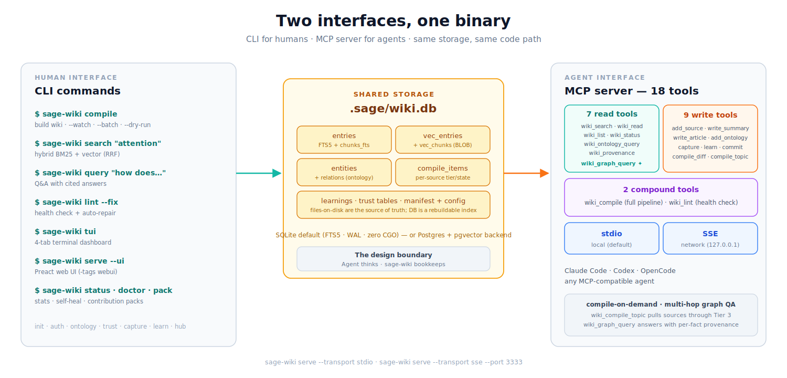

[English](../../README.md) | [中文](README_zh.md) | [日本語](README_ja.md) | [한국어](README_ko.md) | [Tiếng Việt](README_vi.md) | **Français** | [Русский](README_ru.md)

<!-- translations: may-lag -->
> ⚠️ Cette traduction peut être en retard sur README.md — la version anglaise fait foi.

# sage-wiki

**sage-wiki** est une mémoire graphe et une base de connaissances que les agents IA et les humains construisent et interrogent ensemble. Déposez des documents ; un compilateur LLM les transforme en un wiki interconnecté doté d'un graphe de connaissances — les agents l'interrogent via MCP, les humains le parcourent en markdown brut. Activez les passes de graphe opt-in et il devient un graphe *avec preuves* : entités typées, relations porteuses de provenance, alias résolus et citations par fait dans les réponses. Un seul binaire Go le fait passer du vault personnel au hub d'équipe, jusqu'au graphe de connaissances d'entreprise.

**→ Pour commencer : [Installation](#installation) · [Démarrage rapide](#démarrage-rapide)**

Née de [l'idée d'Andrej Karpathy](https://x.com/karpathy/status/2039805659525644595) d'une base de connaissances personnelle compilée par LLM, construite avec le [Sage Framework](https://github.com/xoai/sage). Quelques leçons tirées en chemin [ici](https://x.com/xoai/status/2040936964799795503).

- **Mémoire graphe avec citations.** Posez des questions relationnelles via `wiki_graph_query` — les réponses ne s'ancrent que dans des arêtes de graphe sérialisées ; avec le graphe avec preuves activé, chaque citation porte son document source et sa confiance.
- **Conçu pour les agents et les humains.** 19 outils MCP plus des fichiers de compétences générés enseignent aux agents quand chercher, capturer et compiler ; les humains disposent de markdown natif Obsidian, d'une TUI et d'une interface web sur les mêmes données.
- **Confiance et provenance.** Les sorties de requêtes restent en quarantaine jusqu'à vérification ; chaque relation avec preuves enregistre quel document l'a affirmée.
- **Vos sources en entrée, un wiki en sortie.** Le pipeline de compilation lit articles scientifiques, notes, code et e-mails ; résume ; extrait les concepts ; et rédige des articles interconnectés — la couche d'ingestion de tout ce qui précède. Chaque nouvelle source enrichit les articles existants ; le wiki se bonifie à mesure qu'il grandit.
- **Interrogez votre wiki.** La recherche hybride au niveau des fragments, avec expansion de requêtes par LLM, re-classement et assemblage de contexte conscient du graphe, renvoie des réponses avec citations.
- **Passe à l'échelle pour 100K+ documents.** La compilation par paliers indexe tout rapidement et ne dépense le budget LLM que là où cela compte.

https://github.com/user-attachments/assets/c35ee202-e9df-4ccd-b520-8f057163ff26

_Les points sur la bordure extérieure représentent les résumés de tous les documents de la base de connaissances, tandis que les points du cercle intérieur représentent les concepts extraits de la base de connaissances, avec des liens montrant comment ces concepts se connectent entre eux._

## Du vault personnel au graphe de connaissances d'entreprise

- **Personnel** — superposez un vault Obsidian existant (`init --vault`), tournez sur des [modèles locaux](../guides/local-models.md) pour un coût nul, et activez les passes de graphe (`ontology.triples` + `ontology.resolve`) quand vous voulez le graphe avec preuves.
- **Équipe** — partagez un même wiki via git ou un [serveur auto-hébergé](../guides/self-hosted-server.md), passez en revue ensemble les propositions de résolution d'entités et la [confiance des sorties](../guides/output-trust.md), et fédérez plusieurs wikis avec le hub. Voir [Configuration d'équipe](../guides/team-setup.md).
- **Entreprise** — déplacez le stockage vers [PostgreSQL/pgvector](../guides/storage-backends.md), activez les [métriques](../guides/metrics.md), placez une authentification devant le serveur, et faites passer l'ingestion à l'échelle avec la [compilation par paliers](../guides/large-vault-performance.md).

## Graphe de connaissances & mémoire de graphe


La recherche vectorielle retrouve des passages qui *ressemblent* à la requête. Un graphe enregistre en plus **comment les choses sont reliées** : une question qui demande deux ou trois sauts se résout par traversée, au lieu d'espérer qu'un seul fragment contienne toute la chaîne. sage-wiki construit ce graphe comme une sortie de compilation — pas une seconde base à synchroniser.

- **Entités et relations typées.** Chaque compilation extrait des entités (concepts, sources, artefacts) et les relie par des relations typées. Le vocabulaire des relations vous appartient — voir
  [relations configurables](../guides/configurable-relations.md).
- **Arêtes sourcées.** Une relation peut porter `evidence` (le passage qui la justifie), `confidence` (0–1) et `source_doc` : une conclusion remonte jusqu'à la phrase qui a justifié l'arête, pas seulement jusqu'au document.
- **Triplets.** Une passe optionnelle en sortie structurée extrait directement sujet → relation → objet. Activation explicite (`ontology.triples`) : elle ajoute un appel LLM par document, et les valeurs par défaut ne dépensent jamais votre clé sans demande.
- **Résolution d'entités.** « K8s » et « Kubernetes » deviennent un seul nœud. Les propositions passent par revue plutôt que d'être fusionnées en silence.

**Le graphe est un canal de recherche, pas une vue annexe.** Chaque recherche fusionne trois canaux — lexical (BM25), vectoriel et proximité de graphe : les termes de la requête amorcent des entités, une traversée bornée classe leur voisinage, et les trois fusionnent selon `search.hybrid_weight_graph`. Une ontologie vide ne coûte rien et laisse les résultats identiques au bit près.

Interrogez-le directement, ou laissez un agent le faire via MCP :

```bash
sage-wiki ontology query --entity kubernetes --depth 3 --direction both
sage-wiki provenance "service mesh"    # quelles sources ont produit ce concept
```

Les arêtes sont bi-temporelles : contredire un fait invalide l'ancienne arête au lieu d'entrer en collision, les réponses par défaut sont sans contradiction, et les requêtes `as_of` répondent à « qu'est-ce qu'on croyait en janvier ? ». Les contradictions ambiguës remontent toujours via la revue de
[confiance des sorties](../guides/output-trust.md). Pour les questions globales (« quels sont les grands thèmes de l'ensemble ? »), la détection de communautés (`ontology.communities.enabled`) génère des résumés de communautés mis en cache et répond via `wiki_graph_query` `mode: "global"`. Détails :
[mémoire de graphe](../guides/graph-memory.md).

## Guides

| Guide | Description |
|-------|-------------|
| [Couche mémoire agent](../guides/agent-memory-layer.md) | Configuration MCP, fichiers de compétences, workflows de capture, boucle lire-capturer-évoluer |
| [API HTTP](../guides/http-api.md) | La surface REST /v1 : auth, modèle d'erreur, idempotence, jobs asynchrones |
| [Mémoire graphe](../guides/graph-memory.md) | Relations avec preuves, extraction de triplets, résolution d'entités, Q&R sur graphe |
| [Configuration](../guides/configuration.md) | Le config.yaml complet annoté, configuration multi-fournisseurs, worker de serve |
| [Configuration d'équipe](../guides/team-setup.md) | Modèles de déploiement git synchronisé, serveur partagé et fédération hub |
| [Qualité de recherche](../guides/search-quality.md) | Indexation par fragments, expansion de requêtes, re-classement, expansion par graphe, ANN |
| [Performance des grands vaults](../guides/large-vault-performance.md) | Compilation par paliers, contre-pression, analyseurs de code, passage à l'échelle 100K+ |
| [Confiance des sorties](../guides/output-trust.md) | Vérification d'ancrage, consensus, cycle de vie promotion/rétrogradation |
| [Authentification par abonnement](../guides/subscription-auth.md) | Connexion OAuth, import de tokens, gestion des identifiants |
| [Serveur auto-hébergé](../guides/self-hosted-server.md) | Docker Compose, Syncthing, reverse proxy, déploiement VPS |
| [Backends de stockage](../guides/storage-backends.md) | Installation SQLite vs PostgreSQL/pgvector, bascule, dimensionnement du pool |
| [Relations configurables](../guides/configurable-relations.md) | Types d'ontologie personnalisés, synonymes multilingues, restrictions de types |
| [Personnalisation des prompts](../guides/customizing-prompts.md) | Échafaudage de prompts, remplacements par type, champs frontmatter personnalisés |
| [Modèles locaux](../guides/local-models.md) | Configuration Ollama, routage GPU/CPU, config de modèle par passe |
| [Métriques](../guides/metrics.md) | Instantanés de logs, endpoint /metrics, contrôles de cardinalité |
| [Packs de contribution](../../CONTRIBUTING.md) | Création de packs, écriture de parseurs, soumission au registre |

## Installation

```bash
# CLI uniquement (sans interface web)
go install github.com/xoai/sage-wiki/cmd/sage-wiki@latest

# Avec interface web (nécessite Node.js pour compiler les ressources frontend)
git clone https://github.com/xoai/sage-wiki.git && cd sage-wiki
cd web && npm install && npm run build && cd ..
go build -tags webui -o sage-wiki ./cmd/sage-wiki/
```

## Démarrage rapide


### Nouveau projet (greenfield)

```bash
sage-wiki init my-wiki && cd my-wiki
# Ajoutez des sources dans raw/
cp ~/papers/*.pdf raw/
# Modifiez config.yaml pour ajouter la clé API et choisir les LLMs
sage-wiki compile                                  # première compilation
sage-wiki search "attention mechanism"             # recherche hybride
sage-wiki query "How does flash attention work?"   # Q&R avec citations
sage-wiki tui                                      # tableau de bord terminal
sage-wiki serve --ui                               # navigateur (build webui)
sage-wiki compile --watch                          # surveillance du dossier
```

Chaque clé de `config.yaml`, annotée ligne par ligne : [Configuration](../guides/configuration.md).

**Structure du projet** (ce que crée `init` — extraits, indicatif non exhaustif) :

```
my-wiki/
├── config.yaml           # fournisseurs, modèles, compilateur, recherche, ontologie
├── raw/                  # déposez les sources ici (articles, papiers, code, images)
├── wiki/                 # sortie compilée — markdown compatible Obsidian
│   ├── summaries/        # résumés LLM par source
│   ├── concepts/         # articles de concepts (le graphe de connaissances)
│   ├── images/           # descriptions d'images par vision
│   ├── outputs/          # réponses déposées (trust.include_outputs : « true »)
│   ├── under_review/     # réponses déposées en attente de revue (défaut)
│   └── archive/          # articles élagués
├── .sage/wiki.db         # un seul fichier SQLite : index FTS, vecteurs, ontologie, file
└── .manifest.json        # correspondance source↔article + état de compilation
```

### Surcouche Vault (vault Obsidian existant)

```bash
cd ~/Documents/MyVault
sage-wiki init --vault
# Modifiez config.yaml pour définir les dossiers source/à ignorer, ajouter la clé API, choisir les LLMs
sage-wiki compile --watch
```

Vous préférez les conteneurs ? Les images Docker multi-arch précompilées et les
fichiers compose sont couverts dans le [guide du serveur auto-hébergé](../guides/self-hosted-server.md).

## Formats sources supportés

| Format      | Extensions                              | Ce qui est extrait                                          |
| ----------- | --------------------------------------- | ----------------------------------------------------------- |
| Markdown    | `.md`                                   | Corps du texte avec frontmatter analysé séparément          |
| PDF         | `.pdf`                                  | Texte intégral via extraction Go pure                       |
| Word        | `.docx`                                 | Texte du document depuis le XML                             |
| Excel       | `.xlsx`                                 | Valeurs des cellules et données des feuilles                |
| PowerPoint  | `.pptx`                                 | Contenu textuel des diapositives                            |
| CSV         | `.csv`                                  | En-têtes + lignes (jusqu'à 1000 lignes)                     |
| EPUB        | `.epub`                                 | Texte des chapitres depuis le XHTML                         |
| E-mail      | `.eml`                                  | En-têtes (de/à/objet/date) + corps                          |
| Texte brut  | `.txt`, `.log`                          | Contenu brut                                                |
| Transcriptions | `.vtt`, `.srt`                       | Contenu brut                                                |
| Images      | `.png`, `.jpg`, `.gif`, `.webp`, `.svg`, `.bmp` | Description via LLM de vision (légende, contenu, texte visible) |
| Code        | `.go`, `.py`, `.js`, `.ts`, `.rs`, etc. | Code source                                                 |

Il suffit de déposer les fichiers dans votre dossier source — sage-wiki détecte le format automatiquement. Les images nécessitent un LLM capable de vision (Gemini, Claude, GPT-4o). Besoin d'un format non listé ? sage-wiki prend en charge les [parseurs externes](#parseurs-externes) — des scripts dans n'importe quel langage qui lisent stdin et écrivent du texte sur stdout.

## Mémoire graphe

D'emblée, le wiki construit un graphe de connaissances par proximité de
mots-clés — des concepts liés là où des mots-clés de relation coexistent avec
un `[[wikilink]]` dans le même bloc. Activez les
**passes de graphe opt-in** pour en faire un graphe avec preuves :

- **Extraction de triplets** (`ontology.triples.enabled`) — un appel LLM
  supplémentaire par document entièrement compilé extrait des entités et des
  relations typées, chacune portant un extrait de preuve, une confiance et un
  document source.
- **Résolution d'entités** (`ontology.resolve.enabled`) — les variantes de
  forme de surface (« NASA » / « National Aeronautics and Space Administration »)
  sont liées à une entité canonique. Les propositions à haute confiance
  s'appliquent automatiquement (seuil 0.85 ; mettez exactement `1.0` pour une
  revue seule), et chaque lien est exactement réversible avec
  `ontology resolve --unlink`.
- **Q&R sur graphe** — l'outil MCP `wiki_graph_query` répond aux questions
  relationnelles multi-sauts ancrées *uniquement* dans un ensemble borné et
  sérialisé d'arêtes ; les citations portent `source_doc` et `confidence`
  quand l'arête est avec preuves (les arêtes par proximité de mots-clés n'en
  portent aucune). Le contexte des Q&R classiques nomme aussi l'arête de
  liaison sous chaque article lié.

Profondeur, coûts, workflow de revue et sémantique d'annulation : [Mémoire graphe](../guides/graph-memory.md).

## Commandes

La surface principale ; exécutez `sage-wiki <command> --help` pour les flags.

| Commande | Description |
| ------- | ----------- |
| `sage-wiki init [dir] [--vault] [--skill <agent>] [--pack <name>] [--prompts] [--force]` | Initialiser le projet (greenfield ou surcouche vault) |
| `sage-wiki compile [--watch] [--batch] [--estimate] [--dry-run] [--no-cache] [--fresh] [--re-embed] [--re-extract] [--prune]` | Compiler les sources en articles wiki |
| `sage-wiki serve [--transport stdio\|sse] [--ui] [--port 3333]` | Serveur MCP / interface web |
| `sage-wiki reindex [--drop-chunk-vectors]` | Reconstruit l'index de chunks à partir des documents sur disque avec les `chunk_size` / `chunk_overlap_tokens` actuels |
| `sage-wiki search "query" [--tags ...] [--boost-tags ...] [--limit N] [--channels bm25,vector,graph] [--expand] [--rerank]` | Recherche hybride (BM25 + vecteur + graphe ontologique) |
| `sage-wiki query "question"` | Q&R sur le wiki avec citations |
| `sage-wiki tui` | Tableau de bord terminal interactif |
| `sage-wiki ontology <query\|list\|add\|resolve>` | Interroger, gérer et résoudre le graphe d'ontologie |
| `sage-wiki ingest <url\|path>` / `sage-wiki add-source <path>` | Ajouter des sources |
| `sage-wiki source <show\|list>` / `sage-wiki coverage` | Inspecter les sources et la couverture de compilation |
| `sage-wiki status` / `sage-wiki doctor` / `sage-wiki diff` | Santé, validation de la config, modifications en attente |
| `sage-wiki lint [--fix]` / `sage-wiki list` / `sage-wiki write <summary\|article>` | Maintenance et écritures manuelles |
| `sage-wiki hub <init\|add\|remove\|search\|status\|list\|compile>` | Hub multi-projets |
| `sage-wiki learn "text"` / `sage-wiki capture "text"` / `sage-wiki scribe <session-file>` | Capture de connaissances |
| `sage-wiki skill <refresh\|preview> [--target <agent>]` | Générer ou actualiser les fichiers de compétences agent |
| `sage-wiki provenance <source-or-concept>` / `sage-wiki version` | Correspondances de provenance, version |

Les familles de commandes thématiques vivent avec leurs guides : `pack *` dans
[CONTRIBUTING](../../CONTRIBUTING.md), `auth *` (login, import, status, logout,
migrate) dans [Authentification par abonnement](../guides/subscription-auth.md), et
`verify` / `outputs *` dans [Confiance des sorties](../guides/output-trust.md).

## TUI

```bash
sage-wiki tui
```

Un tableau de bord terminal complet avec 4 onglets :

- **[F1] Parcourir** — Naviguer dans les articles par section (concepts, résumés, sorties). Flèches pour sélectionner, Entrée pour lire avec rendu markdown glamour, Échap pour revenir en arrière.
- **[F2] Rechercher** — Recherche floue avec aperçu en panneau divisé. Tapez pour filtrer, résultats classés par score hybride, Entrée pour ouvrir dans `$EDITOR`.
- **[F3] Q&R** — Questions-réponses conversationnelles en streaming. Posez des questions, obtenez des réponses synthétisées par LLM avec citations des sources. Ctrl+S sauvegarde la réponse dans outputs/.
- **[F4] Compiler** — Tableau de bord de compilation en direct. Surveille les répertoires sources pour détecter les modifications et recompile automatiquement. Parcourez les fichiers compilés avec aperçu.

Changement d'onglet : `F1`-`F4` depuis n'importe quel onglet, `1`-`4` sur Parcourir/Compiler, `Esc` retourne à Parcourir. Quitter avec `Ctrl+C`.

## Interface web

```bash
sage-wiki serve --ui        # http://127.0.0.1:3333, nécessite un build -tags webui
```

- **Navigateur d'articles** avec rendu markdown, coloration syntaxique et `[[wikilinks]]` cliquables
- **Recherche hybride** avec résultats classés et extraits
- **Graphe de connaissances** — visualisation interactive à forces dirigées des concepts et de leurs connexions
- **Q&R en streaming** — posez des questions et obtenez des réponses synthétisées par LLM avec citations des sources
- **Table des matières** avec suivi du défilement ; mode sombre/clair avec détection des préférences système ; les liens d'articles brisés apparaissent en gris

Construite avec Preact + Tailwind, intégrée via `go:embed` (~1.2 MB, ~420 KB compressée gzip) ; omettez `-tags webui` pour un binaire CLI/MCP uniquement. Tokens d'authentification, hôtes autorisés et durcissement du déploiement : [Serveur auto-hébergé](../guides/self-hosted-server.md).

## Intégration MCP



Ajoutez à `.mcp.json` (Claude Code ; les autres agents dans le [guide de la couche mémoire agent](../guides/agent-memory-layer.md)) :

```json
{
  "mcpServers": {
    "sage-wiki": {
      "command": "sage-wiki",
      "args": ["serve", "--transport", "stdio", "--project", "/path/to/wiki"]
    }
  }
}
```

Clients réseau : `sage-wiki serve --transport sse --port 3333`. Le serveur
expose 19 outils — recherche, lecture, requête de graphe, capture, `wiki_query`
(réponses aux questions avec dépôt relu), compilation à la demande et plus ;
la configuration par agent et les workflows de capture
vivent dans le [guide de la couche mémoire agent](../guides/agent-memory-layer.md).

**Fichiers de compétences agent** — `sage-wiki skill refresh --target <agent>`
écrit une section comportementale dans le fichier d'instructions de l'agent
(CLAUDE.md, .cursorrules, …) lui enseignant quand chercher, quoi capturer et
comment interroger, dérivée de votre config. Cibles : `claude-code`, `cursor`,
`windsurf`, `agents-md` (Antigravity), `codex`, `gemini`, `generic`.

### Compétences agent

Installez la compétence de référence de sage-wiki pour qu'un assistant de
codage connaisse toute la surface d'outils — les 19 outils MCP, les
équivalents REST `/v1`, les drapeaux opt-in, les tiers, la sémantique de
compilation asynchrone et les codes d'erreur — sans lire ce README :

```bash
# Claude Code
npx skills add https://github.com/xoai/sage-wiki --skill sage-wiki

# Ou manuellement : copiez skills/sage-wiki/SKILL.md dans .claude/skills/
```

La compétence pipeline `sage-wiki-integrate` intègre sage-wiki dans un
nouveau dépôt de façon interactive (détection du langage → installation du
client ou configuration MCP → test de fumée stocker-et-retrouver) :

```bash
npx skills add https://github.com/xoai/sage-wiki --skill sage-wiki-integrate
```

Les deux compétences sont générées depuis le registre MCP réel
(`go run ./tools/skillgen/`) et vérifiées contre la dérive en CI — elles ne
peuvent pas devenir obsolètes quand les outils changent. Pre-1.0 —
épinglez une version.

**Capture de connaissances** — les agents stockent leurs découvertes en retour
via `wiki_capture` / `wiki_learn`, fermant la boucle lire-capturer-évoluer.
Workflows et astuces : [Couche mémoire agent](../guides/agent-memory-layer.md).

## SDK clients

Clients typés pour l'API REST `/v1` (pre-1.0 — épinglez une version) :

**Python** — `pip install sagewiki` (≥3.9, `httpx` uniquement) :

```python
from sagewiki import SageWiki

c = SageWiki()  # SAGE_WIKI_URL / SAGE_WIKI_TOKEN depuis l'env
for r in c.search("attention", limit=5).results:
    print(r.final_score, r.content[:80])
job = c.compile(topic="attention")
job.wait(timeout=600)  # timeout explicite requis
```

**TypeScript** — `npm install sagewiki` (zéro dépendance runtime, `fetch`
global ; Node ≥18, Deno, Bun, runtimes edge) :

```ts
import { SageWikiClient } from "sagewiki";

const c = new SageWikiClient();
const results = await c.search("attention", { limit: 5 });
const job = await c.compile({ topic: "attention" });
await job.waitUntilDone({ timeoutMs: 600_000 });
```

Les deux clients couvrent toute la surface `/v1` : recherche, provenance,
requêtes de graphe, wiki compilé, captures/écritures et jobs compile/lint
asynchrones avec une taxonomie d'erreurs pilotée par code. Docs :
[Python](../../clients/python/README.md) · [TypeScript](../../clients/typescript/README.md) ·
[guide API HTTP](../guides/http-api.md). Les programmes Go peuvent éviter
HTTP entièrement — voir [Intégration dans un programme Go](#intégration-dans-un-programme-go).

### Exemples

Intégrations copiables, exercées en CI contre un serveur réel :

- [`examples/langgraph/`](../../examples/langgraph/) — nœuds LangGraph adossés à
  la mémoire (client Python) : récupération avec le pattern
  `uncompiled_sources` → compile par sujet, plus capture.
- [`examples/vercel-ai-sdk/`](../../examples/vercel-ai-sdk/) — `search`,
  `graphQuery`, `provenance` comme outils Vercel AI SDK (client TypeScript) ;
  déployable en edge.

### Intégration dans un programme Go

Pour appeler les mêmes outils depuis votre propre processus Go — sans sous-processus, ni stdio ni port à gérer — utilisez `pkg/sagewiki` avec le transport in-process de mcp-go :

```go
srv, err := sagewiki.NewServer("/path/to/wiki")  // project must already exist
if err != nil {
    return err
}
defer srv.Close()  // the caller owns the DB handle here

cli, err := client.NewInProcessClient(srv.MCPServer())
if err != nil {
    return err
}
defer cli.Close()

if err := cli.Start(ctx); err != nil {
    return err
}
if _, err := cli.Initialize(ctx, mcp.InitializeRequest{}); err != nil {
    return err
}

res, err := cli.CallTool(ctx, mcp.CallToolRequest{
    Params: mcp.CallToolParams{
        Name:      "wiki_search",
        Arguments: map[string]any{"query": "attention", "limit": 5},
    },
})
```

Le projet doit déjà exister et l'appelant possède le handle de base de données, donc `Close` est obligatoire — contrairement à `serve`, rien d'autre ne le ferme. Les logs vont sur le stderr de l'hôte, et `initialize` rapporte la version de build de sage-wiki (`dev` pour un simple `go build`) ; appelez `sagewiki.SetVersion` au démarrage pour rapporter votre propre version.

Le package est **expérimental** tant que sage-wiki est en pré-1.0 : les signatures Go sont censées rester stables, mais les noms d'outils, les schémas d'arguments et le format de `config.yaml` peuvent changer à chaque release. Épinglez une version.

## Opérations

- **Stockage** — SQLite par défaut (fichier unique, zéro config) ; PostgreSQL +
  pgvector pour les déploiements serveur. Bascule et dimensionnement du pool : [Backends de stockage](../guides/storage-backends.md).
- **Observabilité** — instantanés de logs structurés et un endpoint `/metrics`
  opt-in : [Métriques](../guides/metrics.md).
- **Sorties structurées** — les passes d'extraction LLM utilisent le mécanisme
  natif de chaque fournisseur (tool-use Anthropic, `response_format` OpenAI,
  `responseSchema` Gemini) avec un repli validant par extraction de blocs de code.
- **Identifiants** — les tokens d'abonnement vivent dans le trousseau de l'OS
  quand il est disponible ; exécutez `sage-wiki auth migrate` une fois pour y
  déplacer les identifiants stockés en fichier. [Authentification par abonnement](../guides/subscription-auth.md).
- **Configuration** — chaque clé, annotée, avec des recettes multi-fournisseurs
  et le worker de compilation du mode serve : [Configuration](../guides/configuration.md).
- **Résolution d'entités** — application automatique à 0.85, exactement réversible avec `--unlink` ; voir [Mémoire graphe](#mémoire-graphe) ci-dessus.
- **Types de relations/entités personnalisés** — étendez les types intégrés ou
  ajoutez les vôtres (`ontology.relation_types`), avec synonymes multilingues
  et restrictions de types : [Relations configurables](../guides/configurable-relations.md).
- **Confiance des sorties** — les sorties de requêtes restent en quarantaine
  jusqu'à être ancrées, confirmées par consensus ou promues manuellement : [Confiance des sorties](../guides/output-trust.md).
- **Réglage de la recherche** — découpage en fragments, expansion, re-classement,
  expansion par graphe et ANN opt-in : [Qualité de recherche](../guides/search-quality.md).

### Coût

sage-wiki suit l'utilisation des tokens et estime le coût de chaque compilation.
Le **cache de prompts** (activé par défaut) réutilise les prompts système entre
les appels au sein d'une passe de compilation — Anthropic et Gemini mettent en
cache explicitement, OpenAI met en cache automatiquement — économisant 50-90%
sur les tokens d'entrée. L'**API Batch**
(Anthropic, OpenAI et Gemini) divise par deux le coût des grandes compilations :

```bash
sage-wiki compile --batch       # soumettre le lot, point de contrôle, quitter
sage-wiki compile               # vérifier le statut, récupérer à la fin
```

`compile --estimate` prévisualise le coût ; `compiler.mode: auto` bascule
automatiquement en batch au-delà d'un seuil. Détails : [Configuration](../guides/configuration.md).

### Passage à l'échelle pour les grands vaults

La compilation par paliers achemine chaque source selon son type et son
utilisation au lieu de tout compiler par LLM :

| Palier | Ce qui se passe | Coût | Temps par doc |
|------|-------------|------|-------------|
| **0** — Indexation seule | Recherche plein texte FTS5 | Gratuit | ~5ms |
| **1** — Indexation + embedding | FTS5 + embedding vectoriel | ~$0.00002 | ~200ms |
| **2** — Analyse de code | Résumé structurel via analyseur regex (sans LLM) | Gratuit | ~10ms |
| **3** — Compilation complète | Résumer + extraire les concepts + rédiger les articles | ~$0.05-0.15 | ~5-8 min |

Pour les grands vaults : indexez tout au palier 1 (un vault de 100K documents
en ~5.5 heures), puis compilez à la demande — la promotion automatique, la
contre-pression et les analyseurs de code sont couverts dans
[Performance des grands vaults](../guides/large-vault-performance.md).

## Écosystème

### Packs de contribution

Les packs regroupent types d'ontologie, prompts et déclencheurs de compétences
pour un domaine. Huit packs intégrés fonctionnent hors ligne :

| Pack | Public | Ontologie clé |
|------|----------|-------------|
| `academic-research` | Chercheurs | cites, contradicts, finding, research_hypothesis |
| `software-engineering` | Équipes dev | implements, depends_on, adr, runbook |
| `product-management` | PM | addresses, prioritizes, user_story |
| `personal-knowledge` | Preneurs de notes | relates_to, inspired_by, fleeting_note |
| `study-group` | Étudiants | explains, prerequisite_of, definition |
| `meeting-organizer` | Managers | decided, assigned_to, action_item |
| `content-creation` | Rédacteurs | references, revises, draft, published |
| `legal-compliance` | Équipes juridiques | regulates, supersedes, policy, control |

`sage-wiki init --pack academic-research` en applique un à l'initialisation ;
`pack install <name|url>` en ajoute d'autres. Créer et publier des packs :
[CONTRIBUTING](../../CONTRIBUTING.md).

### Parseurs externes

Gérez n'importe quel format de fichier avec un script dans n'importe quel
langage (stdin → texte sur stdout), déclaré dans `parsers/parser.yaml` derrière
un double opt-in — ils s'exécutent comme des sous-processus non isolés avec
application d'un timeout et suppression des variables d'environnement. Détails
d'écriture et de durcissement : [CONTRIBUTING](../../CONTRIBUTING.md) ;
la discussion sur la frontière de confiance : [Configuration d'équipe](../guides/team-setup.md).

### Équipes

Trois modèles de partage — synchronisation git, serveur partagé, fédération
hub — plus la revue de confiance en équipe et la gestion des coûts : [Configuration d'équipe](../guides/team-setup.md).

## Benchmarks

Deux suites répondent à des questions différentes. Détail complet :
[eval/benchmarks/REPORT.md](../../eval/benchmarks/REPORT.md) · [eval/REPORT.md](../../eval/REPORT.md)

**Benchmarks mémoire** — sait-il répondre à des questions sur une longue conversation ? Jeux de données publiés, jugés par LLM, avec les prompts et la procédure de
[mem0ai/memory-benchmarks](https://github.com/mem0ai/memory-benchmarks) et sage-wiki comme backend (gpt-5 comme répondeur/juge, échantillons réduits) :

| Benchmark | Score | Mem0 Platform |
|---|---|---|
| LOCOMO (150 q) | **92.0%** @ top-50 | 91.8% @ top-50 |
| LongMemEval-S (30 q) | **93.3%** @ top-50 | 94.8% @ top-50 |
| BEAM 100K (60 q) | **0.691** mean nugget | 0.641 @ 1M |

Ce n'est pas un classement strictement comparable : mem0 exécute sa plateforme gérée sur les jeux complets, il s'agit ici d'échantillons (±4–5 pts), et les pipelines de compilation diffèrent. Les réserves sont détaillées dans le rapport.

**Évaluation qualité + performance** — le wiki est-il bien formé et rapide ? Fonctionne sur n'importe quel wiki compilé, sans clé API, en quelques secondes. Médiane sur 10 wikis réels : score global **87,4 %**, extraction de faits 100 %, rappel@10 100 %, intégrité des références croisées 100 %. Récupération en mémoire : FTS5 top-10 **0,035 ms**, RRF hybride **4,9 ms**, BFS graphe **0,001 ms**.

```bash
python3 eval/eval.py .                      # qualité + perf sur votre wiki
python3 -m pytest eval/eval_test.py -q      # auto-tests du harnais
```

## Licence

MIT
